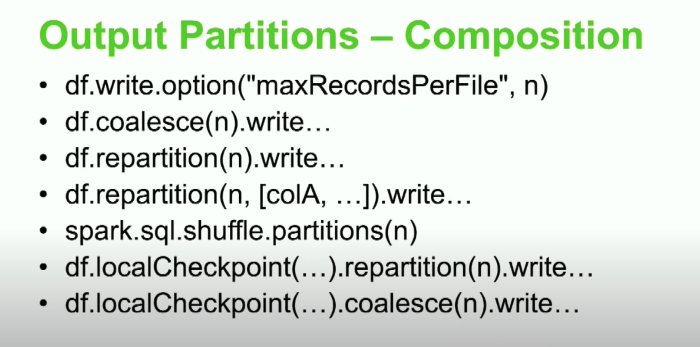

### Spark Core and proper optimization by Daniel Tomes, Databricks
- Spark Hierarchy
- The spark UI
- Rightining and optimizing
- Advanced Optimizatios


<br />
<p align = "center">

<figcaption align = "center">  Fig.1 - Spark Hierarchy  </figcaption>


A cluster consist of a driver and an executor. A particular executor has N cores or slots and a core has a memory and local storage. Memory is divided into two parts: storage and working. 
The working memory can be utilized by spark workloads unless there is a persistent object that consumes this storage worksapce upto the configured amount which by default is 50%.So half of the memory will be allocated to the working memory and half to the storage like persisted objects. Also, every executor has DISKS, eventhough spark is an in-memory solution
but we still have to have DISKS. The disks are attached directly and those provides space for shuffle partitions, for the shuffle stages, and also they provide space for persistence to disk and spills from the execution of the workload. The disk has attributes: fast SSDs, RAM disks, and all the way down to remote amounted NFS (network file system) drives. The type of disks attached to your cluster are extermely important to mame sure that your'e optimizing your hardware. If they are not fast neither will your shuffles be so. 
<br />

From the software side, SPARK have ACTIONS and TRANSFORMATIONS. Transforamtions are lazy meaning that they do not do anything until ACTION is called. There are Narrow and Wide transformations. The wide transfotmation require data to be moved around the NODE so that it can then be exectuted. The wide transformation require shuffles. So one thing that is really impoirtant to understand is actions perform one or many transforamtions at a time which spawn off jobs. Jobs contains stages one or more and stages contain tasks. Tasks are the only part that interact with the hardware directly. Everything else is meant for orchestration and collections to better coordinate the tasks. Every task inside of the stage does the exact same only on another segment of the data. If a task required to do sth. different, it's required that it be inside of another stage, thatw the hirerchary the spark sdheres to and it's important to know that one task is done by one core which is one partition, and one task takes up one slot. 
<br />

The spark UI is one of the most important thing whenever you are trying to figure out what is going with your job. The executive tab is typically use this to understand if there is any problem with a node. If there is an issue of disk failing or hardware failure can be found in the executive tab. The SQL tab is use when you have to optimize your workload. 

Hardware is very important whether you are in cloud or in on prem. The important questions to ask are:
- Core count and its speed
- Memory per core (working and storage)
- Local disk type, count, size, and speed
- Network speed and topology 
- Data lake properties (rate limits)
- Cost/ Core/ Hour
 Is your action efficient?
 Long stages, spills, laggard tasks etc?
 CPU utilization 
 Ganglia/Yarn etc.
 Tails


 Minimize data scans (lazy load)
 - Data skipping:
 - HIve partitions
 - Bucketing
 - Databricks Delta Z-ordering
 - What is it/ How to do it?
 - 


### Partitions
Each of a number of portions into which some operating systems divide memory or storage. Its basically a subset of a super set. But a Hive partition is not the same as spark partition. They are both subset of a super set but a spark partition is a piece of data that's being broken down so that it can be operated on in parallel and in memory. A hive partition is in the storage on disk and persistence. So spark partition can be broken down into three types: Input, Shuffel and Output. You bring data in, you transform it, and you write it down some where or you bring it back to your screen. The reason that it's really complicated to siae these partitions correctly and understand them because each of these   

- Input: 
   - Controls size
      - spark.default.parallelism (don't use)
      - spark.sql.files.maxPartitionBytes (mutable)
      - assuming source has sufficient partitions


- Shuffle:
    - Control = Count 
      - spark.sql.shuffle.partitions

- Output:
  - Control = Size
    - Coalesce (n) to shrink
    - Reparttion (n) to increase and or balance (shuffle)
    - df.write. option("maxRecordsPerFile", N)


Most people get the outputs size right , spark does a pretty good job on sizing the inputs as long as your source data is splittable and are in the right format and compression type. Spark does a pretty good job in sizing these in most cases. Remember, everybody gets the shuffle counts wrong. "The default shuffle partitions is 200 (I don't know why), its hard coded in but it is 200"- that's wrong. If you are working with a shuffle stage of less than 20GB, 200 is fine. But who works with spark with 20GB files, right? Make sure that you understand how to change it. The correct partition count should be equal to the input stage size divided by your target size. The target size should be less than 200MB in most cases. But if you see shuffle stages or shuffle partitions at 20TB you have done sth. quite wrong and its never gonna finish. 

Shuffle is the most data intensive job and never set the shuffle partition less than the no. of cores present in your cluster. If you have 2000 cores use them all. 


- Largest shuffle stage 
    - Target size <= 200 MB/partitions

- Partition Count = Stage Input Data/ Target size
    - Solve for partition count

- Example 
    - Shuffle Stage Input = 210GB
    - x = 210000MB/200MB = 1050
    - spark.conf.set("spark.sql.shuffle.partitions",1050)
    - But if cluster has 2000 cores
    - spark.conf.set("spark.sql.shuffle.partitions",2000)


When you don't right the shuffle partitions, you will get spills and spills are the slowest 
thing that you can probably do and een though you have fastest RAM disk and memory, the shuffles are very inefficient. In this example, the spill size is 552GB to memory and only read 53.9GB, it's beacause of the way the data gets decompressed in deserialized to put onto disk and into memory that it gets to this large size. So on a job that has a 35TB shuffle, it's not uncommon to see a 90TB shuffle spill. 90TB   complete if you have enough disk but you probably don't see your dog's gonna fail all right so make sure that we're not spilling more than you look at these quartiles and you see that these  are only 3GB per task but if I had a lot of task that's going to add up really fast. 

<br />
<p align = "center">

<figcaption align = "center">  Fig. Shows the typical detail of a spark job which shows shuffle partitions and spills. </figcaption>
<br />

So let's work again with the correct shuffle partitions. I am going to set them to 480 with the same exact cluster, why 480, well I noticed that it was only 270MB but I ma spilling 550GB of data which means I have high redundancy in this data so I am getting extreme columnar compression but when its get in the memory I am actually deserializing and decompressing and then recompressing into row compression and that makes everythong change so 
I know that is going to be a little bit more data intensive when I get into memory so I am actually scale that down to 100MBs (200MBs should also be fine). Now,  54GBs coming in divided by my target size of 100MBs equals 540 shuffle partitions. Well, if I used 540 you will notice that the task times are about a minute and half that would mean that after the fifth set of tasks had come through in a minute and half the fifth set, I would still have 63% of the next batch to go through which means that 38% of my cluster was that they are idle during that last pass so its better for me to go ahead and down that a little bit to where it's a factor of my core count so that total is 480. Hence, I chose 480 and now you can see my shuffle sizes are 115MBs exactly what I would have expect. Thos works linealry is that equation pretty much will solve most of your problems. 

<br />
<p align = "center">

<figcaption align = "center">  Fig. Shows the typical detail of a spark job which shows shuffle partitions and spills. </figcaption>
<br />

          
Ther are problems with source data and there are challanges with certain structures of data as data gets more complicated on the input such as structs of arrays or arrays of structs and stuff like that of varying sizes things get a little bit messed up on the input so we might have to change our input partitions sizes because of all those reasons I just said about compressions, different type of compressions columnar versus rows. Another reason is beacuse I want to increase parallelism, If I have 200 cores and I only had 10 partitions coming in on the read, I am only gonna be able to use 10 cores to read that data so I want to break that down. Another reason is I am gonna genearate a lot of data if i am gonna use and explode and I am gonna create a whole bunch of new data columnar or row then it's important that I make 
sure that the initial partitions are much smaller so that I can have more space for all that data I am going to create. There's also another one that's UDFs we'll talk about non vectorized UDFs in a little bit and these have to go all the way down out of deserialized 


<br />
<p align = "center">

<figcaption align = "center">  Fig. Shows the typical detail of a spark job which shows shuffle partitions and spills. </figcaption>
<br />

Here is an example, on the first I use the default max partition bytes size of 128MBs, this is the knob that you twist so that you can change your input partition count. I am reading the same source file on both of these but you'll notice that I am getting the count of partitions with that last line  
On the first one I have 90 and on the second one 710 becauseI scaled that down to 16MBs instead of the default of 128Mbs. That almost cut my time to half, this cluster has 96 cores and I was able to complete the job in 2.9mins instead of 4.6min just by tweaking that down to make sure I increased my parallelism.  

<br />
<p align = "center">

<figcaption align = "center">  Fig. shows the  </figcaption>
<br />


<br />
<p align = "center">

<figcaption align = "center">  Fig. shows </figcaption>
<br />


### `Output partitions- Right sizing` 

You need to change the output partition for two reasons. First, because of the size of the files and where and how you want them structured. Second, is the composition of those files. For example, if I want to write 15GBs and I want all my files to be 1.5GBs in size only 10 cores are allowed to handel that right. If my cluster has 96 cores I have 86 cores sitting idle. When this happens especially whenever your'e trying to write lots of data or if you try to write really large files these writes might take some time. And if your shuffle is tied with your write that gonna really impact your parallelism on your shuffle which is really gonna make this take a long time and you are not utilizing your cluster.   


<br />
<p align="center">
   
  
  
  <figcaption align = "center">  Fig. shows </figcaption>
</p>


<br />
<p align = "center">

<figcaption align = "center">  Fig. shows </figcaption>
<br />


### `Advanced Optimization`
- Finding imbalances
- Persisiting
- Join optimizations
- Handling skew
- Expensive Operations
- UDFs
- Multi-Dimensional Parallelism 
  


### Balance
Balance in a parallel processing system is the most impratant thing from garbage collection, disk speed to network topology and everything. The data is the most common thing that leads to imbalance. Finding root cause of imbalnce is the most important task. Data skew, it could be bad network may be you have anode that has messed up network (may be rare case but they cause stuck when they happen and you don't expect it). Spark UI will allow you to find the culprit. Also, garbage collection if you have a hot box may be because of data skew but maybe it's  becuse you have a messed up box. In this example we have data skew and when this happens there is imbalance, just cancell the job and try again. 


<br />
<p align="center">
   
  
  
  <figcaption align = "center">  Fig. shows </figcaption>
</p>


### `Persistence`
Many people don't know that Caching is persisting. Cache is a certain type of persist. DF tell persist with memory and disk that means I'm going to persist a memory as much as I can into that storage memory segment and then I'm going to put the rest on disk after I fill that 
percentage. Realize that the working memory can scale up and down as there's available memory 
in that storage space but as you persist more it  consume that space so you are gonna hit that wall faster meaning that you are gonna spill sooner, meaning that your shuffle stages and your partitions need to be smaller because you are gonna have less room in your memory. 
<br />
Persist are not free, they take time and space and they take away from the working operation 
sizes that you can have in other parts of your workloads so PERSIST WITH CARE. It is not free and it takes a lot of time to deserialaized and serialized whatever's got to happen and then move that data to the medium that it's going to be persisted on so that means ony persist when you have Repetition, look through the sequel plan and identify super sets that are being used in many ways for subsets. I know that's confusing if you look through all those boxes where the data is coming in from without any persistence and you see that they are scanning the same sets of files and the filters are similar, what kind of super set could you create 
that where all those boxes would read from memory or read from disk as a persistent state. There are lot of persistence that you can use cache is great because cache goes the memory first which is a great medium and then if I don't have room it'll go to disk that's fantastic 
but if you have RAM disk and I have a big data set that I am going to hit a 100 times just why not persist it to those RAM disks and utilize that fast medium that I have and then leave all that memory available for my workload. 
Lastly, persist takes up space clean up after yourself especially on shared clusters. People 
are lazy obviously developers are the laziest don't forget to unpersist if you do that in your production workloads or even if you do that in a shared cluster your'e shooting yourself and everyone else that your'e working with in the foot because now your'e taking up that storage memory not allowing them to cache the memory and you're taking up that space that could be used to save thet for memory spills or for working memory so make sure you remember to un-persist every time you write a persist or a cache write an equal and opposite unpersist. 

<br />
<p align="center">
   
  
  
  <figcaption align = "center">  Fig. shows </figcaption>
</p>

<br />

### `Join Optimization`
- `SortMergeJoins (Standards)`: The most common join and the safe join is sortmerge join. And you have to have that when you have a large data set on both side of the join required.
- `Broadcast Joins (Fastest)`: Fastest, that's when one is small enough to fit in the other side in the memory on one side. 
```
- One side of the join is small in size
- Automatic if: one side< spark.sql.autoBroadcastJoinThreshold (default 10MBs)
- Risks: not enough driver memory, DF>spark.driver.maxResultSize, DF> Single Executor Available Working Memory
- Production: Mitigate the risks, Validation functions
  ```
## Persistence vs. Broadcast

<br />
<p align="center">
   
  <figcaption align = "center">  Fig. shows </figcaption>
</p>
<br />


- `Skew Joins`: 
- The data shows skew.The count for certain keys is ~4million  while certain count is ~20 which caused large skew in the join. When I do a group by or join thats typically when the skew starts to happen. In databricks you can use skew optimization as skewDF.hint("Skew", "skewKey", skewedKeys), Seq(keyCol), "inner"). If you are not in the databricks, you can use the SALTING method (second pic). Salting means adding some random noise to the data. When you do salt create a random no. between 0 and no. of my shuffle partion -1. That is going to add the randomness equal to the randomness I have in my cluster which I mean is the no. of partitions during that shuffle stage. Suppose if I have 2000 shuffle partitions than the saltVAl will be random (0, 1999). Thsi random data is not tied to the original data and can be deleted afterwards but it actually let me distribute it across all the nodes.  


<br />
<p align="center">
   
    
  <figcaption align = "center">  Fig. shows </figcaption>
</p>
<br />


- `Range Joins`: 
- `BroadcastedNestedLoop Joins (BNLJ)`: 
  
   
<br />


### Omit expensive operations:
- 


Git is a version control software which comes pre installed with linux/mac but have to download for 
windows. Git is a memory card for a code or folder in your local computer to track the changes made and to time travel in the older version if needs come. To track any folder in your computer: go to that particular folder and do git init. ls -la will give you a .git directory. Make some changes and follow add/commit and push to save the changes made. 

<br />  

`How to create Github repo from command line`

```
curl -u "sumandhamala" https://api.github.com/user/repos -d '{"name":"New_Repo_Name", "private":true}' 
- Provide authentication as github token/PW does not work. 
-Change name of the repo
curl -u "$USER:$TOKEN" -X PATCH -d "$newName" https://api.github.com/repos/$user/$oldName
```

<br />

- git help < git command like push or what ever you want to know >
- git init:   &nbsp;  Initializes a git repository by creating initial .git directory in a new or in an existing project. Its like putting a memory in that particular folder.
- git clone: &nbsp; Copies an existing Github repo to local machine.
- git status: &nbsp; checks the working dorectory to see if up-to-date with the remote repo. 
- git add . : add all the changes to the staging area of the working directory. This is the first step in commiting changes to your local versions of the repo before pushing them to the remote GIthub version of the repo. 
- git commit -m "provide the commit message": &nbsp; Git records the changes made to yur version of the repo. 
- git push: &nbsp; pushes the local repo changes to the remote repo. To push the chnages you need username and classical token (no PW accepted now days)
- git pull:&nbsp; 
- git status: &nbsp;
- git branch: &nbsp; 
  
  
  <br />
  <br /> 

  
  ### `Git branch`
  Git branch allows you to work independent environment so that your changes don't affect other branches until you merge.

  ```  
    - git status
    - git branch <branch_name>
    - git branch -a
    - git push -u origin <branch_name>
    - git checkout <branch_name>
    - git status
    - echo "test >> test.sh
    - git status
    - git add test.sh
    - git commit -m "Test"
    - git commit -am "Description of the changes"
    - git push 
    - git chekout master
    - git checkout -b <branch_name>: Its a new way to create the branch if it does not exist. It depends on the refrence branch like if you are in main than it will create a brance refencing the main branch
    - git branch -D/d <branch_name> (-d will give warning that the branch is not fully merged so use -D)
    - git push origin --delete <branch_name>
    - git commit --ammend --no-edit
    - git checkout <commit token from git log>: to go back intime and see previous commit.
    - git pull origin master: to pull the Gthub repo master branch to the local computer to sync between them else will be trouble.
  ```
 
 
 
- git --version:&nbsp; Check the version 
- git config --global user.name "  "
- git config --user.email "your email" 
- git config --list
- git help <command> or git <command> --help
- git init: &nbsp; start tracking a project 
- rm -rf .git: if you wanna remove a git tracking for a particular project
- git status: 
- touch .gitignore
- git add -A or git add . or git add <what you want to file>
- git reset <what you want to remove from staging area>
- git commit -m "Detail description"
- git log: see commit that we have made 
- git clone <url> <where you want to clone>
- git clone https://github.com/sumandhamala/pySparkTraining.git  /Users/sumandhamala/pySpark 
- git remote -v : information abot clone 
- git branch -a
- git diff: shows the chnages made to the project or code
- git status 
- git add -A
- git status 
- git commit -m "message"
- git pull origin master or main : it pull the remote repo to sync with other developer since last time we have pull it
- git push origin master or main :   push the commits to the remore repo.
- git branch <branch_name>
- git  branch:  list all the branches 
- git checkout <branch_name>
- git push -u origin <branch_name>: (-u associates local to remote repo)
- git branch -a:to see all branches 
- git checkout master
- git pull origin master 
- git branch --merged
- git merge <name_branch>
- git push origin master
- git branch --merged
- git branch -d <branch_name>
- git push origin --delete <branch_name>
-     
- 


 
 
<br />
<p align = "center">

<figcaption align = "center">  Fig.1 - Best description of the git work flow. Picture credit goes to bytebytego.com </figcaption>


# MarkDown Tips and Tricks
###  `Headers:`
 - #H1, ## H2, ## H3, H4 ###, H5 ####, ......
_____________________________________________________________________
  ### `Space and paragraph change:`
- <br />  changes the paragraph
- &nbsp; add space between the words
________________________________________________________________________
### `Text Decorations:`  
- **bold**, *italic*, 
- ~~ StrikeThrough text ~~
________________________________________________________________________
### `Links:`  
- [My github](https://github.com/sumandhamala "Add description if you want")
- [Links](#headers "link to previous place in the documents")
- [Reference link]: https://www.youtube.com/watch?v=ftOBvusMHjQ
-  [My Github][Reference link] 
________________________________________________________________________  
### `Images:`
-  
________________________________________________________________________  
### `Unordered and Ordered List:` 
- `*` for unordered list while 1., 2., for ordered list

________________________________________________________________________
### `Code Blocks:`
```python (programming language name)
def Sum (self.a, self.b):
  returns self.a + self.b
```
Addition = print(Sum(1+2))
________________________________________________________________________
### `Inline code block:`
- `Suman`. 

________________________________________________________________________
### `Tables:`
-  Tables can be created with headings and text alignment options.

    |Stocks|Price|
    |:---:|:---:|
    |TSLA|230|
    |APPL|130|

    Tables        | Are           | Cool  |
    | ------------- |:-------------:| -----:|
    | col 3 is      | right-aligned | $1600 |
    | col 2 is      | centered      |   $12 |
    | zebra stripes | are neat      |    $1 |

    Markdown | Less | Pretty
    --- | --- | ---
    *Still* | `renders` | **nicely**
    1 | 2 | 3
   
_____________________________________________________________________

### ` Blockquotes:`
> This is an example of a blockquote
>> This is sub blockquote example.
________________________________________________________________________

### `Horizontal Rules:`
- Three or more ...
- Hyphens: ---
- Asterisks: ***
- Underscores: ___
  
  _______________________________________________________________________

### `Youtubes videos Link:`
- [](https://www.youtube.com/watch?v=ftOBvusMHjQ)
_________________________________________________________________________
### `Comments which does not render`
- [This is a hidden comments format.]: #
- <!-- This is commented out. Like the case in HTML. -->
_________________________________________________________________________
### `Callouts`
> :bulb: **Tip:** Here is an important tip to remember! ...
> 
> :smile: **Smile emoji:** Here is the smiling emoji.  ...
> 
> :blush: **BLush emoji:** Here is the blush emoji.
> 
> :cry:  **Cry emoji:** Here is the cry emoji.
________________________________________________________________________
### `Resources:`
  1) [Markdown cheatsheet](https://github.com/adam-p/markdown-here/wiki/Markdown-Cheatsheet#links)

2) [MarDown Notes](https://docs.github.com/en/get-started/writing-on-github/getting-started-with-writing-and-formatting-on-github/basic-writing-and-formatting-syntax)